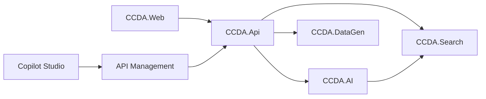

# CCDA Documentation

Documentation for the **Contoso County District Attorney (CCDA) AI Case Review Platform** — a
citation-first, RAG-based legal case-review demo built on Azure AI Search, Azure AI Foundry,
Azure API Management, Microsoft Copilot Studio, and .NET Aspire.

> **FOR DEMONSTRATION PURPOSES ONLY — FICTIONAL CASE DATA.**
> AI assists attorney review; it never replaces attorney judgment. Every AI response includes
> source citations (document + page) and a confidence assessment.

## Start here

| If you want to… | Read |
| --- | --- |
| Understand how it's built | [Architecture](architecture.md) |
| Run it locally or deploy to Azure | [Deployment](deployment.md) |
| Present it to executives (15-min demo) | [Facilitator guide](facilitator.md) |
| Do a hands-on lab | [Workshop](workshop.md) |
| Follow an exact demo script | [Demo script](demo.md) |
| Connect a Copilot Studio agent | [Copilot Studio integration](copilot-studio/README.md) |
| Provision the Azure resources | [Infrastructure (Bicep + APIM)](../infra/README.md) |

## Platform at a glance

- **Citation-first:** every workflow result carries `Citations[]` (document + page) and a
  confidence level (High ≥0.75 / Medium ≥0.50 / Low).
- **Runs offline:** in-memory search + local chat by default; flips to Azure AI Search +
  Azure OpenAI via configuration — no app code changes.
- **Four AI workflows:** Summary, Timeline, Briefing, and grounded Legal Q&A.
- **Deterministic data:** the synthetic generator is seeded, so demos are reproducible and
  every document is watermarked fictional.

See the repository [root README](../README.md) for the project layout and build status.
