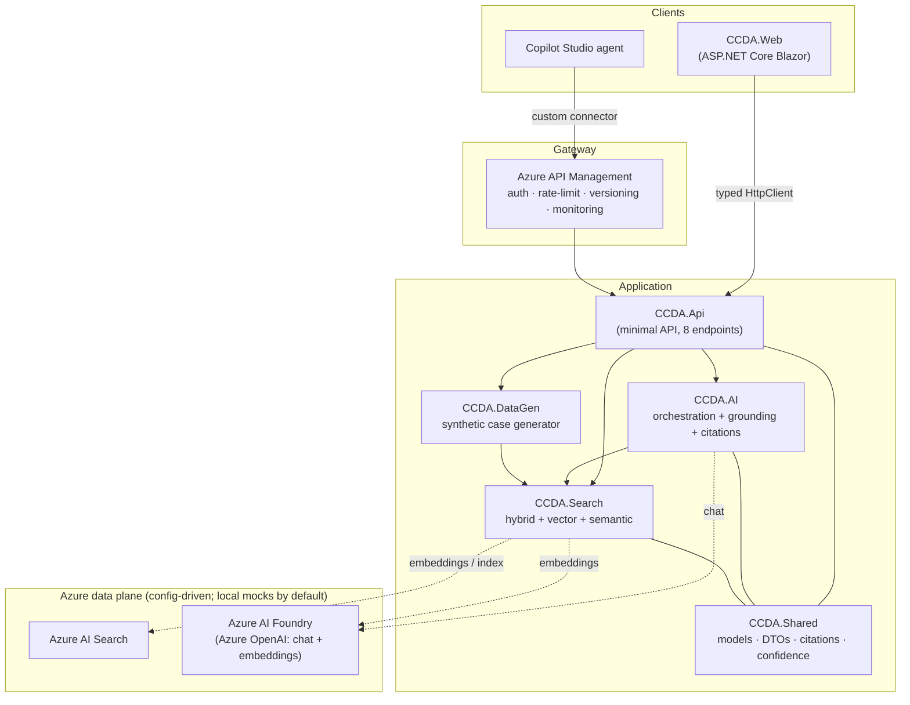
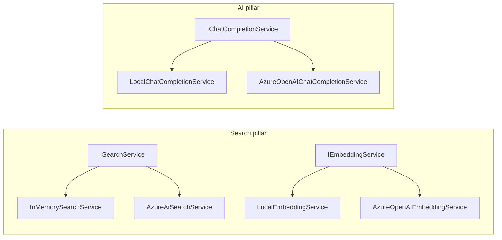
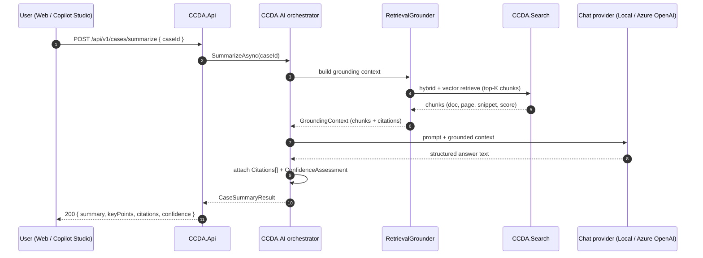
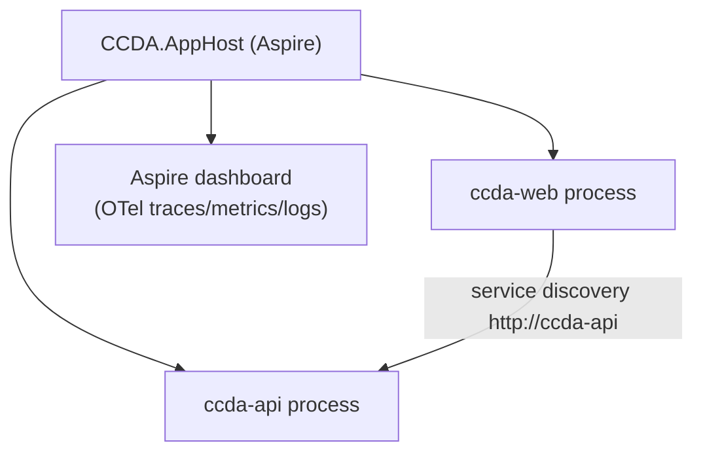
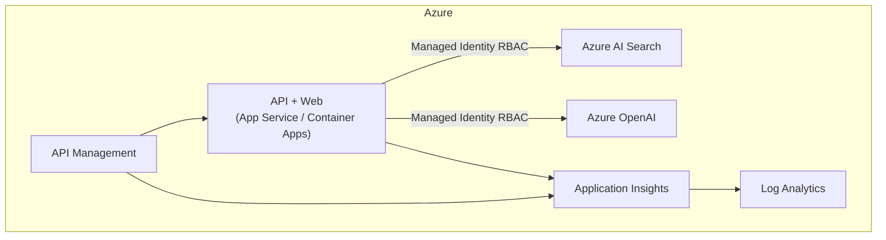
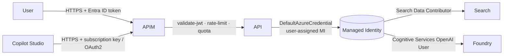

# CCDA Architecture

The **Contoso County District Attorney (CCDA) AI Case Review Platform** is a citation-first,
retrieval-augmented (RAG) system for reviewing legal cases. This document covers the logical
architecture, the runtime/physical topology, the request data flow, and the security model.

> **FOR DEMONSTRATION PURPOSES ONLY — FICTIONAL CASE DATA.**
> AI assists attorney review; it never replaces attorney judgment. Every AI response carries
> **source citations** (document + page) and a **confidence** assessment.

---

## 1. Logical architecture

**Pillars**

| Project | Responsibility |
| --- | --- |
| `CCDA.Shared` | Domain models, DTOs, citation + confidence types, constants (fictional-data watermark). |
| `CCDA.Search` | `ISearchService` / `IEmbeddingService` / `ICaseCatalog`; chunking, page-level citation tracking; in-memory **and** Azure AI Search providers. |
| `CCDA.AI` | `IAiOrchestrator` + four workflows (Summary, Briefing, Timeline, Legal Q&A); retrieval grounding + citation construction; local extractive **and** Azure OpenAI chat providers. |
| `CCDA.Api` | Minimal API exposing the 8 endpoints; OpenAPI; wired to Search + AI + DataGen. |
| `CCDA.DataGen` | Deterministic (seeded) synthetic case generator; watermarking; auto-ingestion + indexing report; CLI. |
| `CCDA.Web` | Blazor Server case-review UI consuming the API via a typed client. |
| `CCDA.AppHost` | .NET Aspire orchestration + OpenTelemetry dashboard. |
| `CCDA.ServiceDefaults` | Shared OTel, health checks, resilience, service discovery. |

---

## 2. Config-driven provider selection

Every external dependency sits behind an interface with an **offline mock** default and an
**Azure-backed** implementation selected by configuration. The full demo runs with no Azure
subscription; setting the Azure keys flips each pillar to the real service.

| Configuration | Default | Switch to Azure |
| --- | --- | --- |
| `Azure:Search:Endpoint` | empty → `InMemorySearchService` | set endpoint → `AzureAiSearchService` |
| `Ccda:Embeddings:Provider` | `Local` → `LocalEmbeddingService` | `AzureOpenAI` + `Ccda:Embeddings:Endpoint` |
| `Azure:Foundry:Provider` | `Local` → `LocalChatCompletionService` | `AzureOpenAI` + `Azure:Foundry:Endpoint` |

When an endpoint is set with no API key, the providers authenticate with
`DefaultAzureCredential` (the deployed Azure resources have local auth disabled — see
[`infra/README.md`](../infra/README.md)).

---

## 3. Data flow — a grounded, cited answer

**Citation-first contract.** Every workflow result type carries `Citations[]`
(`documentId`, `caseId`, `sourceFile`, `pageNumber`, `chunkId`, `snippet`) and a
`ConfidenceAssessment` (`score`, `level`, `rationale`). Confidence buckets: **≥0.75 High**,
**≥0.50 Medium**, else **Low**. The grounder never lets a workflow answer without retrieved
context, so responses stay traceable to source pages.

---

## 4. Runtime / physical topology

**Local (default demo):** the Aspire AppHost runs the API and Web as child processes and
publishes an OpenTelemetry dashboard. All AI/search runs in-process against the mock providers.

**Azure (deployed):** the same containers/apps run on Azure compute behind APIM, using a
user-assigned managed identity to reach AI Search and Azure OpenAI over RBAC, with all
telemetry flowing to Application Insights / Log Analytics.

See [`infra/`](../infra/README.md) for the Bicep that provisions this topology.

---

## 5. Security model

| Layer | Control |
| --- | --- |
| Transport | HTTPS only end to end. |
| Gateway | APIM subscription key required; optional Microsoft Entra ID `validate-jwt`; per-subscription rate limit + daily quota; correlation-id propagation. |
| Identity | User-assigned managed identity; **no keys in app config** (`disableLocalAuth` on Search + OpenAI). |
| Authorization | Least-privilege data-plane RBAC (Search Index/Service Contributor; Cognitive Services OpenAI User). |
| Data | 100% synthetic, watermarked ("FOR DEMONSTRATION PURPOSES ONLY / FICTIONAL CASE DATA"); Power Platform DLP classification for the connector. |
| Content safety | Azure OpenAI default content-safety policy; grounding guardrail forbids ungrounded legal answers. |

---

## 6. Related docs

- [Deployment guide](deployment.md)
- [Facilitator guide](facilitator.md) — executive story + 15-minute demo
- [Workshop guide](workshop.md)
- [Demo script](demo.md)
- [Copilot Studio integration](copilot-studio/README.md)
- [Infrastructure (Bicep + APIM)](../infra/README.md)
