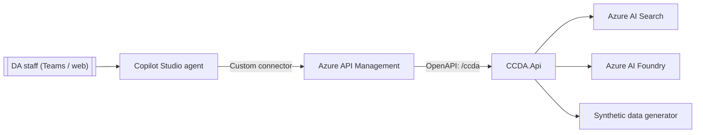

# Copilot Studio Integration Guide — CCDA Case Review Agent

This guide describes how to build a **Microsoft Copilot Studio** agent that lets Contoso
County District Attorney (CCDA) staff review cases conversationally — summaries, timelines,
briefings, grounded Q&A, and on-demand synthetic demo cases — by calling the CCDA API
through **Azure API Management (APIM)**.

> **Documentation + integration artifacts only.** This repository does **not** author or
> publish a live agent. It ships the connector definition (`custom-connector/`) and topic
> designs (`topics/`) so a maker can reproduce the agent in their own environment.

> **FOR DEMONSTRATION PURPOSES ONLY — FICTIONAL CASE DATA.**
> The agent assists attorney review. It never replaces attorney judgment. Every answer it
> returns is grounded in indexed case documents and carries **source citations** (document +
> page) and a **confidence** level.

---

## 1. Architecture



- The agent never calls the backend directly. **APIM** enforces auth, rate limits,
  versioning, and monitoring (see `../../infra/apim`).
- The **custom connector** (`custom-connector/apiDefinition.swagger.json`) is the OpenAPI 2.0
  contract Copilot Studio imports. Its `host`/`basePath` point at the APIM gateway `/ccda`.

---

## 2. Environment strategy & ALM

Use **three Power Platform environments** aligned to the Azure environments:

| Environment | Purpose | APIM instance | Publishing |
| --- | --- | --- | --- |
| **Dev** | Makers build topics/actions. | `ccda-apim` (dev) | Unmanaged solution. |
| **Test/UAT** | Facilitator + reviewer validation. | `ccda-apim` (test) | Managed solution import. |
| **Prod/Demo** | Live demo delivery. | `ccda-apim` (prod) | Managed solution import. |

**ALM practices**

- Put the agent, the custom connector, and its connection references in a **single solution**.
- Use **connection references** and **environment variables** for the APIM host and product
  key so the same solution promotes across environments without edits.
- Export the solution as **managed** for Test and Prod; keep Dev unmanaged.
- Source-control the exported solution `.zip` (unpacked with Power Platform CLI `pac solution unpack`).
- Gate promotion on the deployment pipeline used for the rest of the platform (see `../../.github`).

---

## 3. Security

- **Transport:** APIM only accepts HTTPS. The connector's `schemes` is `https`.
- **Gateway auth:** the connector sends the APIM **subscription key**
  (`Ocp-Apim-Subscription-Key`) supplied at connection time — never embedded in a topic.
- **User auth (recommended):** enable the **Entra ID `validate-jwt`** block in
  `../../infra/apim/policies/api.xml`. Register an app for the agent, grant it the
  `api://<app-id>` audience, and configure the connector for **OAuth 2.0 (Microsoft Entra ID)**
  so each user's identity flows to APIM.
- **Least privilege:** issue the agent a dedicated APIM subscription scoped to the `ccda`
  product; rotate the key on a schedule.
- **Data handling:** all content is synthetic and watermarked. Configure **DLP policies** in
  the Power Platform environment so the connector is classified appropriately (Business data).
- **Content safety:** the backing Azure OpenAI deployment uses the default content-safety
  policy (`Microsoft.DefaultV2`). Keep the agent's answers grounded — do not add topics that
  bypass the connector to answer legal questions from the model's own knowledge.

---

## 4. Import the custom connector

1. In **Power Apps** (`make.powerapps.com`) → **Custom connectors** → **New → Import an OpenAPI file**.
2. Upload `custom-connector/apiDefinition.swagger.json`.
3. On the **General** tab, set **Host** to your APIM gateway host
   (`<name>.azure-api.net`) and keep **Base URL** `/ccda`.
4. On **Security**, confirm **API Key**, header `Ocp-Apim-Subscription-Key`
   (or switch to **OAuth 2.0** per §3).
5. **Create connector**, then **Test** with a subscription key and a known case id.

`custom-connector/apiProperties.json` documents the connection parameters and publisher
metadata for `pac connector create`/`update` if you prefer CLI-driven ALM.

### Operations exposed

| Operation ID | Method + path | Used by topic |
| --- | --- | --- |
| `ListCases` | `GET /api/v1/cases` | Find a Case |
| `GetCase` | `GET /api/v1/cases/{caseId}` | Find a Case |
| `GetCaseCitations` | `GET /api/v1/cases/{caseId}/citations` | Show Sources |
| `SummarizeCase` | `POST /api/v1/cases/summarize` | Case Summary |
| `BuildCaseTimeline` | `POST /api/v1/cases/timeline` | Case Timeline |
| `BuildCaseBriefing` | `POST /api/v1/cases/briefing` | Case Briefing |
| `AskCase` | `POST /api/v1/cases/chat` | Ask About a Case |
| `GenerateDemoData` | `POST /api/v1/cases/generate-demo-data` | Generate Demo Case |

---

## 5. Topics & actions

Each conversational topic is designed in `topics/`. A topic collects the inputs it needs
(usually a **Case ID**), calls the connector action, then renders the response —
**always surfacing the citations and confidence** returned by the API.

| Topic | Trigger intent | Action |
| --- | --- | --- |
| [Case Summary](topics/case-summary.md) | "summarize case", "what is this case about" | `SummarizeCase` |
| [Case Timeline](topics/case-timeline.md) | "timeline", "what happened when" | `BuildCaseTimeline` |
| [Case Briefing](topics/case-briefing.md) | "briefing", "risks", "recommendation" | `BuildCaseBriefing` |
| [Ask About a Case](topics/ask-about-a-case.md) | "ask", any legal question | `AskCase` |
| [Generate Demo Case](topics/generate-demo-case.md) | "generate demo", "create sample case" | `GenerateDemoData` |

**Knowledge sources.** For general office FAQs (how to use the agent, disclaimers, contacts),
add a Copilot Studio **knowledge source** pointing at a SharePoint site or the `docs/` folder.
Keep case-specific answers flowing exclusively through the connector so they stay grounded and
cited — do not upload case documents as a knowledge source.

**Global disclaimer.** Add a **system topic / conversation start** message:

> "I help review **fictional demonstration** cases. My answers are grounded in indexed case
> documents and include source citations and a confidence level. I assist attorney review — I
> do not replace attorney judgment."

---

## 6. Testing

- Use the Copilot Studio **Test** pane against the **Dev** environment.
- Seed a known case first via the **Generate Demo Case** topic (e.g. seed `42`) so results are
  reproducible, then exercise Summary → Timeline → Briefing → Ask.
- Verify every response renders **citations** and a **confidence** badge.
- Confirm low-confidence answers include the model's caveat and suggested follow-ups.
- Validate throttling: rapid repeated calls should surface APIM's `429` gracefully (the topics
  include a generic error message node).

---

## 7. Files

```
docs/copilot-studio/
  README.md                              # this guide
  custom-connector/
    apiDefinition.swagger.json           # OpenAPI 2.0 connector (import this)
    apiProperties.json                   # connection parameters + publisher metadata
  topics/
    case-summary.md
    case-timeline.md
    case-briefing.md
    ask-about-a-case.md
    generate-demo-case.md
```
